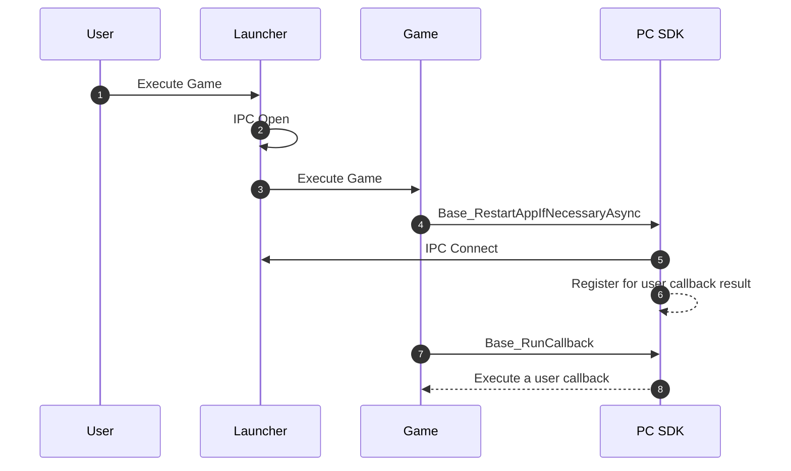
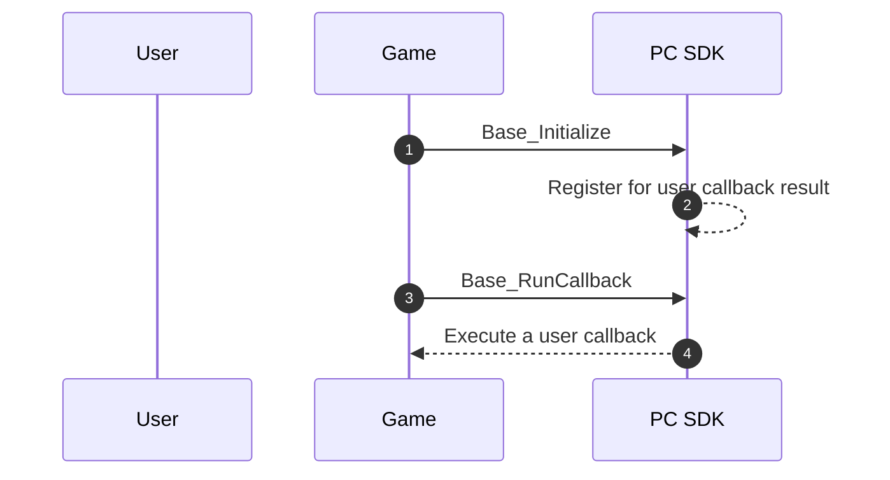
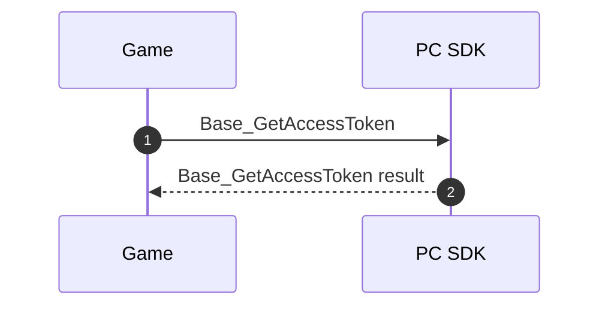
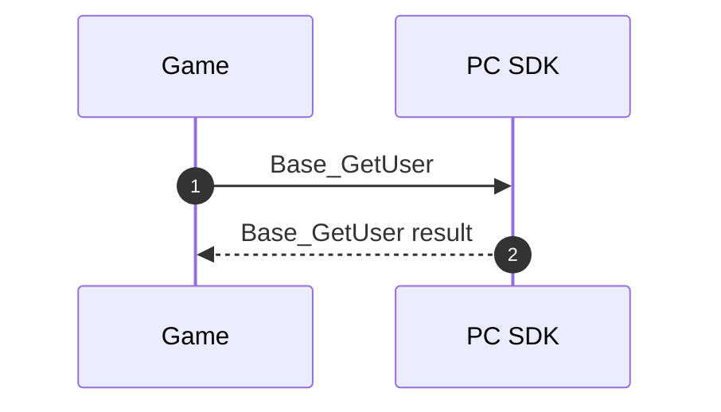
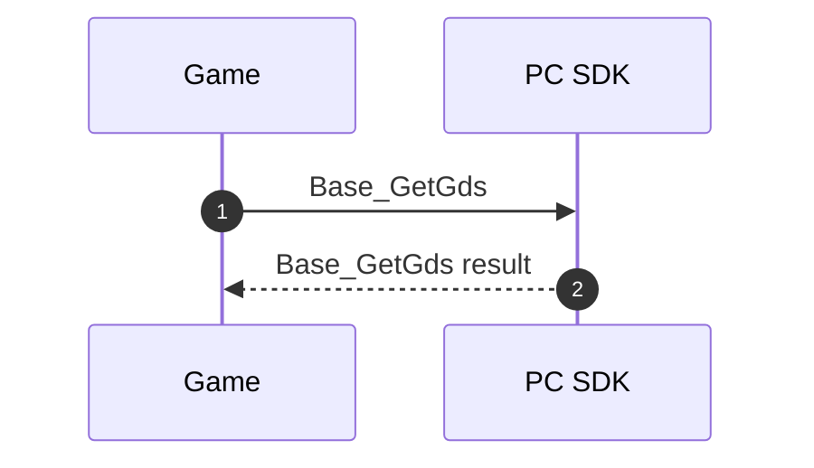
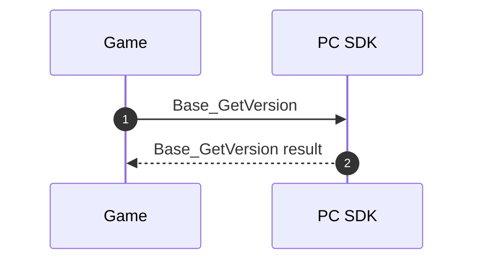
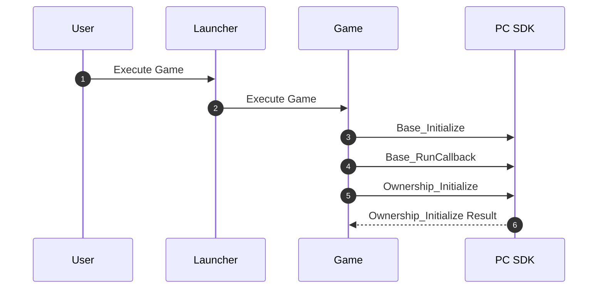
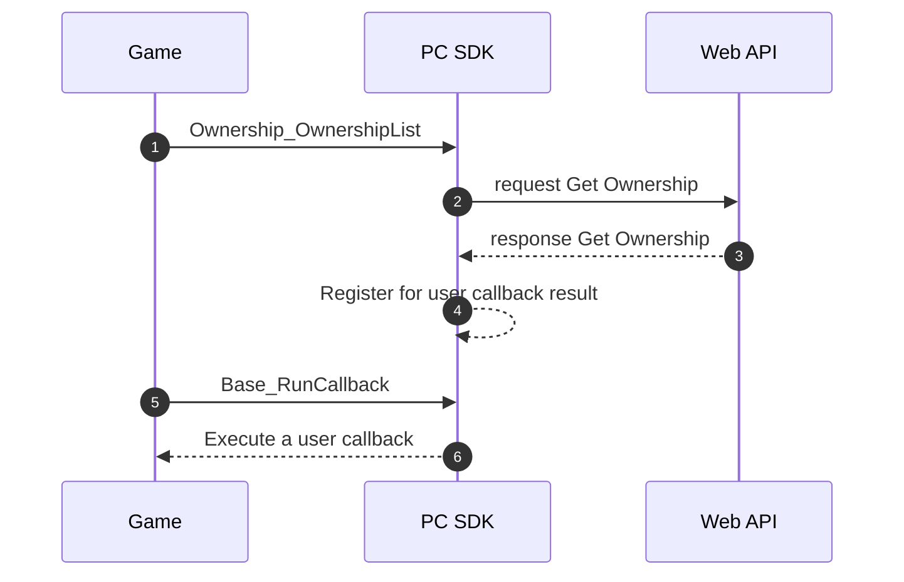

# 스토어 게임에서 Stove PC SDK NativeCpp 기본 기능 연동하기


## 소개
```
이 프로젝트는 Stove PC SDK 를 이용하여 스토브 서비스를 최소한으로 연동하는 방법에 대해 설명합니다.
Stove PC SDK는 이하 PCSDK로 표현합니다.
```


## Stove PC Client 와 연동하기 위한 사전 준비
### [PC Client 다운로드](https://www.onstove.com/ko/download/)를 설치하세요.
   - Live 기본 설치위치 : C:\ProgramData\Smilegate\STOVE
   

### [PCSDK](https://stoveindie.notion.site/STOVE-PC-SDK-3d7e6a5a95784b69b83efd1e79ba701b)를 다운로드 받으세요.

PCSDK의 다른 모듈 패키지 역시 유사한 구조로 구성되어 있으며 연동 방법은 Base SDK 모듈과 동일합니다.

```
Depends                          
└ StovePCSDK                     
  └ BaseSDK                      
    └ Deploy                     
      ├ Bin                      
      │ ├ Win32                  
      │ │└ Release               
      │ │  └ BaseSDK.dll         
      │ └ x64                    
      │   └ Release              
      │    └ BaseSDK.dll         
      ├ Include                  
      │ ├ Misc                   
      │ │ ├ result               
      │ │ │ └ result.h           
      │ │ ├ BaseSDKResult.h      
      │ │ ├ Callbacks.h          
      │ │ ├ Enumerations.h       
      │ │ ├ SDKExports.h         
      │ │ ├ Structures.h         
      │ └ BaseSDK.h              
      └ Lib                      
        ├ Win32                  
        │ └ Release              
        │   └ BaseSDK.lib        
        └ x64                    
          └ Release              
            └ BaseSDK.lib        
```

- **Deploy/Include/[BaseSDK.h](https://stove-store.github.io/native/kr/html/a00002.html)** :
    - Base SDK를 사용하기 위해 소스 코드에 포함해야 하는 헤더 파일입니다.
- **Deploy/Include/Misc/[BaseSDKResult.h](https://stove-store.github.io/native/kr/html/a00005.html)** :
    - Base SDK API의 결과에 대한 enum을 정의하는 헤더 파일입니다.
- **Deploy/Include/Misc/[Callbacks.h](https://stove-store.github.io/native/kr/html/a00213.html)** :
    - Base SDK API가 완료되었을 때 동작을 지정하는 콜백의 형식을 정의하는 헤더 파일입니다.
- **Deploy/Include/Misc/[Enumerations.h](https://stove-store.github.io/native/kr/html/a00234.html)** :
    - Base SDK에서 사용하는 enum을 정의하는 헤더 파일입니다.
- **Deploy/Include/Misc/[SDKExports.h](https://stove-store.github.io/native/kr/html/a00017.html)** :
    - Base SDK DLL 관련 매크로를 정의하는 헤더 파일입니다.
- **Deploy/Include/Misc/[Structures.h](https://stove-store.github.io/native/kr/html/a00249.html)** :
    - Base SDK에서 사용하는 구조체를 정의하는 헤더 파일입니다.
- **Deploy/Include/Misc/result/[result.h](https://stove-store.github.io/native/kr/html/a00014.html)** :
    - PC SDK API의 결과를 나타내는 클래스를 정의하는 헤더 파일입니다.
- **Bin/{architecture}/Release/BaseSDK.dll** :
    - Base SDK의 동적 링크 라이브러리 파일입니다.
- **Lib/{architecture}/Release/BaseSDK.lib** :
    - Base SDK의 정적 라이브러리 파일입니다.
    - Base SDK를 사용하기 위해 소스 코드에 포함해야 하는 헤더 파일입니다.

**참고 사항**
> 위의 예시는 Base SDK 모듈 배포 패키지를 기준으로 패키지 구성을 설명하고 있습니다.  
> 프로젝트 소스 코드에서 #include BaseSDK.h 선언문을 통해 Base SDK의 기능을 사용하실 수 있으며, 기타 헤더 파일은 해당 선언문을 통해 함께 사용할 수 있습니다.

**주의 사항**
> 링크 라이브러리 파일(.dll/.lib)은 게임의 대상 아키텍처에 맞게 적절한 파일을 선택해 주세요.


### [Stove Signature Verifier](https://developers-beta.onstove.com/docs/Store/info/SignatureVerifier)를 다운로드 받으세요.

```
Depends                          
└ StoveSignatureVerifier    
  └ Deploy
    ├ Include
    │ └ StoveSignatureVerifier.h              
    └ Lib                      
      ├ Win32                  
      │ └ Release              
      │   └ StoveSignatureVerifier.lib        
      └ x64                    
        └ Release              
          └ StoveSignatureVerifier.lib        
```


### 게임 정보 준비하기
* 환경 별 테스트에 필요한 계정을 준비해야 합니다.
* 스토브 가입 계정과 출시 게임용 AppKey, GameID를 발급 받았는지 확인해야 합니다.
  * AppKey, GameID 의 발급 정보는 STOVE 스튜디오의 프로젝트 관리 메뉴에서 확인 할 수 있습니다.


## API 명세서
* 전체 API 문서를 보려면 [C++ Native API 명세서](https://stove-store.github.io/native/kr/html/index.html)를 방문하세요.


## 비동기 프로그래밍
PCSDK의 몇몇 API를 제외하고는 대부분 비동기적이고 비차단적입니다.  
PCSDK는 게임의 반응성과 효율성을 높이기 위해 호출 스레드를 차단하지 않는 방식으로 이러한 메서드를 호출합니다.  
비동기 호출은 사용하는 방법은 다음과 같습니다  

Example Code
```
void OnRestartAppIfNecessaryAsyncCallback(const CallbackResult callbackResult, bool restartAppIfNecessary)
{
    if (callbackResult.GetResult().IsSuccessful() == false)
    {
        // 실패 로직
        return;
    }

    // 성공 로직
}

Stove::PCSDK::Base::StovePCInitializeParam initParam;
initParam.SetEnvironment(L"YOUR_ENVIRONMENT");
initParam.SetGameID(L"YOUR_GAME_ID");
initParam.SetApplicationKey(L"YOUR_APPLICATION_ID");

Base_RestartAppIfNecessaryAsync(&initParam, 60'000, OnRestartAppIfNecessaryAsyncCallback);
```

## 동기 프로그래밍
PCSDK에서 제공되는 동기함수는 Result 구조체를 반환합니다.  

Example Code
```
Base::StovePCUser user;
Result result = Base::Base_GetUser(&user);
if (result.IsSuccessful())
{
    Log(L"memberNo : %lld", user.GetMemberNumber());
    Log(L"nickname : %s", user.GetNickname());
    Log(L"gameUserId : %lld", user.GetGameUserId());
}
else
{
    Log(L"SDK Name : %s", callbackResult.GetResult().GetSDKName());
    Log(L"Method Code : %d", callbackResult.GetResult().GetMethodCode());
    Log(L"Result Code : %d", callbackResult.GetResult().GetResultCode());
}
```


## 에러 처리
PCSDK는 리턴 값으로 Result와 CallbackResult를 제공하고 있습니다.  
Result는 Synchronize 함수의 결과값을 전달합니다.  

Example Code
```
Base::StovePCUser user;
Result result = Base::Base_GetUser(&user);
if (result.IsSuccessful())
{
    Log(L"memberNo : %lld", user.GetMemberNumber());
    Log(L"nickname : %s", user.GetNickname());
    Log(L"gameUserId : %lld", user.GetGameUserId());
}
else
{
    Log(L"SDK Name : %s", callbackResult.GetResult().GetSDKName());
    Log(L"Method Code : %d", callbackResult.GetResult().GetMethodCode());
    Log(L"Result Code : %d", callbackResult.GetResult().GetResultCode());
}
```

CallbackResult는 Asynchronize 함수의 결과값을 전달합니다.  

Example Code
```
void OnRestartAppIfNecessaryAsyncCallback(const CallbackResult callbackResult, bool restartAppIfNecessary)
{
    if (callbackResult.GetResult().IsSuccessful() == false)
    {
        Log(L"errorMessage : %s", callbackResult.GetErrorMessage());
        Log(L"externalErrorCode : %d", user.GetExternalError());
        
        Log(L"SDK Name : %s", callbackResult.GetResult().GetSDKName());
        Log(L"Method Code : %d", callbackResult.GetResult().GetMethodCode());
        Log(L"Result Code : %d", callbackResult.GetResult().GetResultCode());

        // 실패 로직
        return;
    }

    // 성공 로직
}
```


## 로컬 로그
PCSDK는 로컬에 로그를 남기고 있습니다.
로컬 로그는 기본적으로 **7일 이상이 지난 로그는 게임이 시작될 때 삭제**합니다. 

Log Path
> Gate8 환경 : %localappdata%/StovePCSDK3Gate8/logs/{GameId}   
> Live 환경 : %localappdata%/StovePCSDK3/logs/{GameId}  


## Stove Signature Verifier를 이용하여 PCSDK의 유효성 검사하기

서버가 없는 스토어 게임의 경우 DLL을 변조하여 해킹하는 것을 방지하기 위해 이 모듈을 연동해야 합니다.  
게임의 Main 함수 가장 위에서 PCSDK의 DLL 변조가 없는지 확인하는 API를 호출합니다.  
*StartStoveVerify()* 는 PCSDK의 DLL의 유효성을 검사하고 변조가 되었다고 판단되면 게임을 강제 종료시킵니다.  

> 이 API는 배포 빌드에서만 적용해야 합니다.  
> 이 기능은 PCSDK의 유효성만 검사를 진행하고 게임 자체의 변조는 막지 못합니다.

Example Code
```
#include "StoveSignatureVerifier.h"

int APIENTRY wWinMain(_In_ HINSTANCE hInstance,
    _In_opt_ HINSTANCE hPrevInstance,
    _In_ LPWSTR    lpCmdLine,
    _In_ int       nCmdShow)
{
#if defined(_NDEBUG) || defined(NDEBUG)
    // only in release mode
    StartStoveVerify();
#endif

    return 0;
}
```

## BaseSDK 연동하기

### 런처로 부터 게임이 실행되었는지 검사하기
Stove 플랫폼에서 게임을 실행하기 위해서는 무조건 PC Client를 통해서 실행되어야 합니다.  

Base_RestartAppIfNecessaryWithTimeout flow chart:  


Example Code  
```
// Base SDK를 사용하기 위해 필요한 헤더 파일을 포함합니다.
#include "BaseSDK.h"

// API와 구조체 등이 포함된 네임스페이스를 사용하도록 선언합니다.
using namespace Stove::PCSDK;
using namespace Stove::PCSDK::Base;

// 유저 콜백 정의를 해야합니다.
void OnRestartAppIfNecessaryAsyncCallback(const CallbackResult callbackResult, bool restartAppIfNecessary)
{
    if (callbackResult.GetResult().IsSuccessful() == false)
    {
        // 실패 로직
        return;
    }

    if (restartAppIfNecessary)
    {
        // 게임 종료
    }

    // BaseSDK 초기화 진행
}

// Base_RestartAppIfNecessaryAsync API를 사용하는 함수/메소드를 구현합니다.
void Base_RestartAppIfNecessaryAsync_Example()
{
    // StovePCInitializeParam 구조체 생성
    // 구조체 필드에 발급 받은 적절한 값을 할당해주세요.
    StovePCInitializeParam initParam;
    initParam.SetEnvironment(L"YOUR_ENV(ex.SANDBOX)");
    initParam.SetGameID(L"YOUR_GAME_ID");
    initParam.SetApplicationKey(L"YOUR_APP_KEY");

    // Base_RestartAppIfNecessaryAsync 호출
    Base_RestartAppIfNecessaryAsync(&initParam, 60,000, OnRestartAppIfNecessaryAsyncCallback);
}
```

### BaseSDK 초기화하기
BaseSDK 초기화를 단계를 구현해야 BaseSDK의 기능을 사용할 수 있습니다.  
> Base SDK 연동 및 초기화는 다른 PCSDK 연동 및 초기화보다 우선으로 이루어져야 하며, BaseSDK 초기화가 이루어지지 않은 경우 PCSDK의 기능을 사용할 수 없습니다.  
> Base SDK 초기화는 UI Thread에서 이루어져야 합니다.  

Base_Initialize flow chart:  


Example Code  

```
// Base_Initialize 유저 콜백 함수를 정의를 해야합니다.
void OnBaseInitializeCallback(const CallbackResult callbackResult)
{
    if (callbackResult.GetResult().IsSuccessful() == false)
    {
        // 실패 로직
        return;
    }

    // 성공 로직
    // 다른 SDK 모듈 초기화 or BaseSDK의 기능 호출
}

// 위에 Base_RestartAppIfNecessaryAsync의 유저 콜백 함수에 다음과 같이 작성한다.
void OnRestartAppIfNecessaryAsyncCallback(const CallbackResult callbackResult, bool restartAppIfNecessary)
{
    ...

    // BaseSDK 초기화 진행

    // StovePCInitializeParam 구조체 생성
    // 구조체 필드에 발급 받은 적절한 값을 할당해주세요.
    StovePCInitializeParam initParam;
    initParam.SetEnvironment(L"YOUR_ENV(ex.SANDBOX)");
    initParam.SetGameID(L"YOUR_GAME_ID");
    initParam.SetApplicationKey(L"YOUR_APP_KEY");

    Base_Initialize(&initParam, OnBaseInitializeCallback);
}
```


### Base_RunCallback 호출하기  
이 Base_RunCallback은 PCSDK에서 전달한 콜백을 실행합니다.  
***Main Thread에서 호출*** 해야하며 주기적으로 (권장 16ms마다) 호출해야 합니다.  

Example Code
```
while (!done)
{
    Base_RunCallback();

    std::this_thread::sleep_for(16ms);
}
```
이것을 호출하지 않으면 PCSDK의 비동기함수에 대한 결과 값을 전달받을 수 없습니다.


### 게임 토큰 획득하기
**Base_GetAccessToken**  API를 통해 STOVE 플랫폼에서 인증을 위해 사용하는 Game Access Token 을 획득합니다.
> BaseSDK 내부에서 Game Access Token을 유효한 토큰으로 갱신하고 있습니다.  
> 게임 내에서 토큰을 캐싱하지 말고 **Base_GetAccessToken** 를 호출해서 사용해야 합니다.  

Base_GetAccessToken flow chart:


Example Code
```
void Base_RestartAppIfNecessaryAsync_Example()
{
    wchar_t accessToken[1024] = { 0, };
    Stove::PCSDK::Result result = Base_GetAccessToken(accessToken, 1024);
    if (result.IsSuccessful())
    {
        Log(L"accessToken : %s", accessToken);
    }
    else
    {
        Log(L"SDK Name : %s", callbackResult.GetResult().GetSDKName());
        Log(L"Method Code : %d", callbackResult.GetResult().GetMethodCode());
        Log(L"Result Code : %d", callbackResult.GetResult().GetResultCode());
    }
}
```


### 사용자 정보 획득하기
**Base_GetUser**  API를 통해 현재 로그인한 사용자의 정보를 조회합니다.  

Base_GetUser flow chart:  


Example Code  
```
// Base SDK를 사용하기 위해 필요한 헤더 파일을 포함합니다.
#include "BaseSDK.h"


// API와 구조체 등이 포함된 네임스페이스를 사용하도록 선언합니다.
using namespace Stove::PCSDK;
using namespace Stove::PCSDK::Base;


// Base_GetUser API를 호출하는 함수/메소드를 구현합니다.
void BBase_GetUser_Example()
{
    // 유저 정보를 받기 위해 변수를 선언합니다.
    StovePCUser user;

    // Base_GetUser 호출
    auto result = Base_GetUser(&user);
    if (result.IsSuccessful())
    {
        Log(L"memberNo : %lld", user.GetMemberNumber());
        Log(L"nickname : %s", user.GetNickname());
        Log(L"gameUserId : %lld", user.GetGameUserId());
    }
    else
    {
        Log(L"SDK Name : %s", callbackResult.GetResult().GetSDKName());
        Log(L"Method Code : %d", callbackResult.GetResult().GetMethodCode());
        Log(L"Result Code : %d", callbackResult.GetResult().GetResultCode());
    }
}
```


### GDS 정보 획득하기  
**Base_GetGds**  API를 통해 현재 로그인한 사용자의 정보를 조회합니다.  

Base_GetGds flow chart:  


Example Code  
```
// Base SDK를 사용하기 위해 필요한 헤더 파일을 포함합니다.
#include "BaseSDK.h"


// API와 구조체 등이 포함된 네임스페이스를 사용하도록 선언합니다.
using namespace Stove::PCSDK;
using namespace Stove::PCSDK::Base;


// Base_GetGds API를 호출하는 함수/메소드를 구현합니다.
void Base_GetGds_Example()
{
    // 유저 정보를 받기 위해 변수를 선언합니다.
    StovePCGds gds;

    // Base_GetGds 호출
    auto result = Base_GetGds(&gds);
    if(result.IsSuccessful())
    {
        Log(L"isDefault : %d", gds.IsDefault());
        Log(L"nation : %s", gds.GetNation());
        Log(L"regulation : %s", gds.GetRegulation());
        Log(L"timeZone : %s", gds.GetTimeZone());
        Log(L"utcOffset : %d", gds.GetUtcOffset());
        Log(L"language : %s", gds.GetLanguage());
    }
    else
    {
        Log(L"SDK Name : %s", callbackResult.GetResult().GetSDKName());
        Log(L"Method Code : %d", callbackResult.GetResult().GetMethodCode());
        Log(L"Result Code : %d", callbackResult.GetResult().GetResultCode());
    }
}
```


### Signin 정보 획득하기
**Base_GetSignin**  API를 통해 현재 로그인한 사용자의 Signin 정보를 조회합니다.  

Base_GetSignin flow chart:  


Example Code  
```
// Base SDK를 사용하기 위해 필요한 헤더 파일을 포함합니다.
#include "BaseSDK.h"


// API와 구조체 등이 포함된 네임스페이스를 사용하도록 선언합니다.
using namespace Stove::PCSDK;
using namespace Stove::PCSDK::Base;


// Base_GetSignin API를 호출하는 함수/메소드를 구현합니다.
void Base_GetSignin_Example()
{
    // 유저 정보를 받기 위해 변수를 선언합니다.
    StovePCSignin signin;

    // Base_GetSignin 호출
    auto result = Base_GetSignin(&signin);
    if(result.IsSuccessful())
    {
        Log(L"personVerify : %d", signin.GetPersonVerify());
        Log(L"emailVerify : %d", signin.GetEmailVerify());
        Log(L"nationality : %s", signin.GetNationality());
        Log(L"providerCode : %s", signin.GetProviderCode());
        Log(L"accountType : %d", signin.GetAccountType());
    }
    else
    {
        Log(L"SDK Name : %s", callbackResult.GetResult().GetSDKName());
        Log(L"Method Code : %d", callbackResult.GetResult().GetMethodCode());
        Log(L"Result Code : %d", callbackResult.GetResult().GetResultCode());
    }
}
```


### Version 정보 획득하기  
**Base_GetVersion**  API를 통해 현재 로그인한 사용자의 Signin 정보를 조회합니다.  

Base_GetVersion flow chart:  


Example Code  
```
// Base SDK를 사용하기 위해 필요한 헤더 파일을 포함합니다.
#include "BaseSDK.h"

// API와 구조체 등이 포함된 네임스페이스를 사용하도록 선언합니다.
using namespace Stove::PCSDK;
using namespace Stove::PCSDK::Base;

// Base_GetVersion API를 호출하는 함수/메소드를 구현합니다.
void Base_GetVersion_Example()
{
    // version 문자열을 받기 위한 버퍼 메모리를 할당해야 합니다.
    wchar_t version[128] = {0, };

    // Base_GetVersion 호출
    auto result = Base_GetVersion(buffer, 128);
    if(result.IsSuccessful())
    {
        Log(L"version : %s", version);
    }
    else
    {
        Log(L"SDK Name : %s", callbackResult.GetResult().GetSDKName());
        Log(L"Method Code : %d", callbackResult.GetResult().GetMethodCode());
        Log(L"Result Code : %d", callbackResult.GetResult().GetResultCode());
    }
}
```


## OwnershipSDK 연동하기  

### OwnershipSDK 초기화하기  
OwnershipSDK 초기화를 단계를 구현해야 OwnershipSDK 기능을 사용할 수 있습니다.  
> Base SDK 연동 및 초기화는 다른 PCSDK 연동 및 초기화보다 우선으로 이루어져야 하며, BaseSDK 초기화가 이루어지지 않은 경우 PCSDK의 기능을 사용할 수 없습니다.  

Ownership_Initialize flow chart:  


Example Code  
```
#include <string>

// Ownership SDK를 사용하기 위해 필요한 헤더 파일을 포함합니다.
#include "OwnershipSDK.h"

// API와 구조체 등이 포함된 네임스페이스를 사용하도록 선언합니다.
using namespace Stove::PCSDK::Ownership;

// Ownership_Initialize API를 사용하는 함수/메소드를 구현합니다.
void Ownership_Initialize_Example()
{
    // API를 호출하여 Ownership SDK를 초기화합니다.
    // 주의) Ownership_Initialize 수행 전 Base_Initialize가 완료되어야 합니다.
    auto result = Ownership_Initialize();
    if(result.IsSuccessful() == false)
    {
        Log(L"SDK Name : %s", callbackResult.GetResult().GetSDKName());
        Log(L"Method Code : %d", callbackResult.GetResult().GetMethodCode());
        Log(L"Result Code : %d", callbackResult.GetResult().GetResultCode());
    }
    
    // 소유권 검사 로직 수행
}
```

### 소유권 조회하기  
**Ownership_OwnershipList**  API를 통해 현재 로그인한 사용자의 소유권 정보를 조회합니다.  

Ownership_OwnershipList flow chart:  


 Example Code  
```
// Ownership SDK를 사용하기 위해 필요한 헤더 파일을 포함합니다.
#include "OwnershipSDK.h"

// API와 구조체 등이 포함된 네임스페이스를 사용하도록 선언합니다.
using namespace Stove::PCSDK::Ownership;

// Ownership_OwnershipList API를 사용하는 함수/메소드를 구현합니다.
void Ownership_OwnershipList_Example()
{
    Ownership_OwnershipList(
        [](CallbackResult callbackResult,
           StovePCOwnership* ownerships,
           uint32_t size)
        {
            if (callbackResult.result.IsSuccessful())
            {
                wchar_t* myGameId = L"YOUR_GAME_ID";

                // 소유권 정보를 이용하여 작업
                bool owned = false;
                for (int i = 0; i < size; ++i)
                {
                    // 
                    if (ownerships[i].GetOwnershipCode() != OwnershipCode::ACQUIRE)
                    {
                        continue;
                    }
                    
                    if (wcscmp(myGameId, ownerships[i].GetGameId()) == 0 && 
                        ownerships[i].GetGameCode() == OwnershipGameCode::BASIC)
                    {
                        owned = true;
                    }
                    
                    if (wcscmp(myGameId, ownerships[i].GetGameId()) == 0 && 
                        ownerships[i].GetGameCode() == OwnershipGameCode::DEMO)
                    {
                        owned = true;
                    }
                    
                    if (wcscmp(myGameId, ownerships[i].GetGameId()) == 0 && 
                        ownerships[i].GetGameCode() == OwnershipGameCode::DLC)
                    {
                        owned = true;
                    }
                }
                
                if (owned == false)
                {
                    // 소유권 없는 상황의 로직 수행
                }
                else
                {
                    // 소유권이 있는 로직 수행
                }
            }
            else
            {
                // 호출 실패 시 에러 로깅 및 전달 필요
            }
        }
    );
}
```
